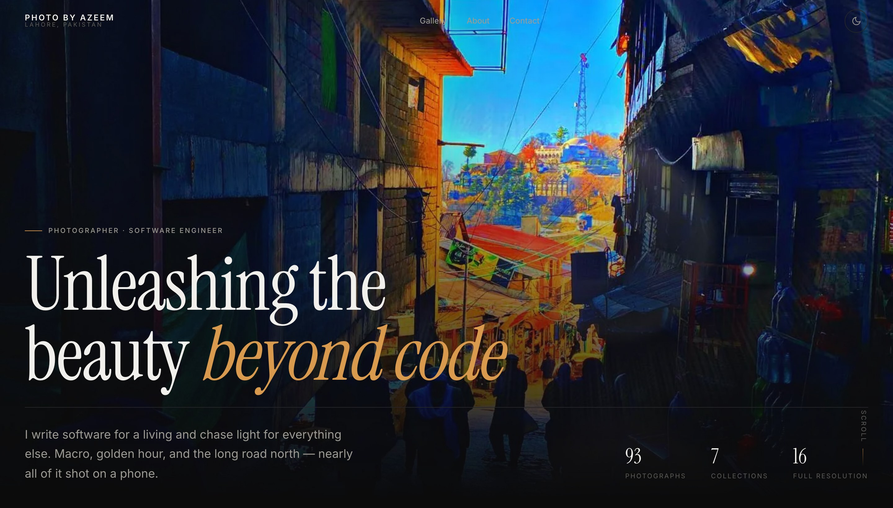
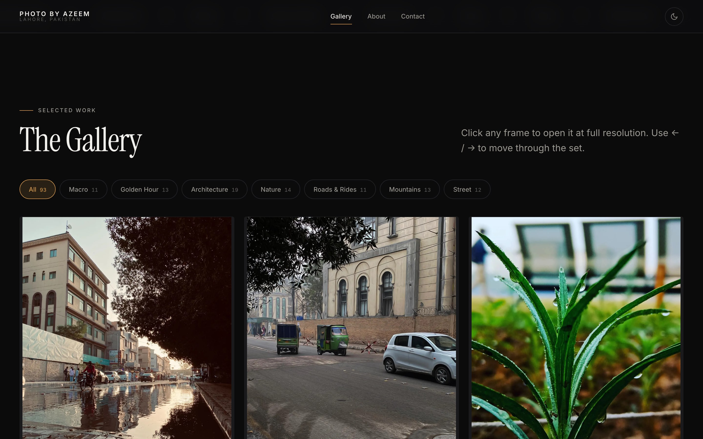
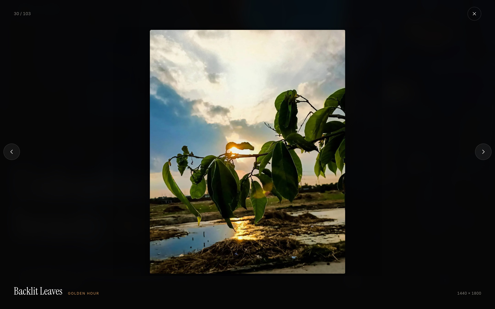

# Photo by Azeem

**The photography of Muhammad Azeem — a software engineer in Lahore, Pakistan.**
Macro and bokeh, golden hour, Lahore's architecture, Makkah and Madinah, and the mountain roads of northern Pakistan. Almost all of it shot on a phone.

### 🔗 [photo-by-azeem.netlify.app](https://photo-by-azeem.netlify.app/)

[](https://photo-by-azeem.netlify.app/)
[](https://photo-by-azeem.netlify.app/)
[](#no-framework-no-dependencies)
[](#the-image-pipeline)



---

## What this is

A hand-built, zero-dependency photography portfolio. No React, no jQuery, no Bootstrap, no carousel library, no lightbox plugin — the entire site is one HTML file, ~5 KB of CSS and ~3 KB of JavaScript, plus a Python pipeline that turns raw camera-roll photos into a properly optimised responsive gallery.

| | |
|---|---|
| **103** curated photographs | across **8** collections |
| **386 KB** critical path | **6** requests to first paint |
| **0** cumulative layout shift | **0** runtime dependencies |

<table>
<tr>
<td width="50%"></td>
<td width="50%"></td>
</tr>
<tr>
<td align="center"><em>Masonry gallery, filterable by collection</em></td>
<td align="center"><em>Full-resolution lightbox — keyboard & swipe</em></td>
</tr>
</table>

---

## Features

- **Masonry gallery** built on CSS multi-column — true masonry with no JavaScript and no layout library, correct at every viewport width.
- **Category filters** (Macro, Golden Hour, Architecture, Pilgrimage, Nature, Roads & Rides, Mountains, Street) with live counts.
- **Full-resolution lightbox** — keyboard (`←` `→` `Esc`), swipe on touch, neighbour prefetching so paging feels instant, focus trapping, and body-scroll locking.
- **Blur-up loading.** Every photo ships an inline ~20px blurred placeholder, so you never see an empty box and the layout never shifts.
- **Zero layout shift.** Real `width`/`height` on every image means the browser reserves the exact box before the file arrives.
- **Dark and light themes**, following your OS preference and remembered across visits.
- **Server-rendered gallery.** The photos are real HTML in the source — crawlable, and painted on the first frame rather than assembled by JS.
- **Works without JavaScript.** Every photograph still renders; the animations are a progressive enhancement, not a requirement.
- **Self-hosted fonts** (latin subset, 62 KB) — no Google Fonts request, nothing render-blocking, nothing third-party.
- Respects `prefers-reduced-motion`.

---

## The image pipeline

The original camera-roll files are kept, untouched, in [`library/`](library/). Everything the site serves is generated from them by [`tools/build_images.py`](tools/build_images.py):

```
library/97.jpg   3024×4032, 2.2 MB
        │
        ├── trim baked-in letterbox bars   (the white Instagram padding)
        ├── resize ladder → 400 / 800 / 1200 / 1600 / 2400 px  WebP
        │     …never upscaling: a photo is only ever offered at sizes it really has
        ├── one JPEG rung as a fallback for the long tail of browsers
        ├── 20px blurred LQIP  → inlined as a data URI (no extra request)
        └── dominant colour    → paints behind the blur
        │
        └──→ data/gallery.json ──→ tools/render_gallery.py ──→ index.html
```

Two details worth calling out:

- **Quality is tiered by size.** The 1600/2400 px rungs are only ever seen fullscreen in the lightbox, where a lower quality setting is visually indistinguishable but ~40% lighter.
- **Letterbox bars are detected and trimmed automatically** — 15 of the photos had white padding baked in from Instagram. A side is only trimmed if it is genuinely uniform *and* smaller than a threshold, so a bright sky is never mistaken for a bar.

The gallery is then **baked into `index.html`**, not fetched at runtime. Crawlers see the photographs, and the grid paints immediately instead of waiting for a JSON round-trip.

---

## Adding new photos

1. Drop the files into [`library/`](library/).
2. Add an entry to `CURATION` in [`tools/build_images.py`](tools/build_images.py) — the filename, its collection, and a title:

   ```python
   "103.jpg": (MOUNTAINS, "First Snow"),
   ```

   Anything *not* listed is skipped. That's deliberate: it's how screenshots, text overlays and outtakes stay out of the portfolio.

3. Rebuild:

   ```bash
   python3 tools/build_images.py     # only processes what's new
   python3 tools/render_gallery.py   # rewrites the gallery into index.html
   ```

4. Commit and push. Netlify deploys automatically.

> Photos are never upscaled. A 900 px original will look fine in the grid but won't be offered as a full-resolution frame — for the lightbox to shine, feed it the largest file you have.

---

## Running it locally

There is no build step and nothing to install to *view* the site:

```bash
git clone https://github.com/Azeem-dash/photography.git
cd photography
python3 -m http.server 8000
# → http://localhost:8000
```

To regenerate images you need Pillow:

```bash
pip3 install Pillow
python3 tools/build_images.py --force
python3 tools/render_gallery.py
```

---

## Project structure

```
index.html              the whole site — gallery baked in
netlify.toml            cache headers, security headers, redirects
data/gallery.json       generated manifest: sizes, placeholders, categories
library/                original photographs (source of truth, never served)
assets/
  gallery/              generated WebP/JPEG derivatives — what the site serves
  css/main.css          ~5 KB gzipped
  js/main.js            ~3 KB gzipped
  fonts/                self-hosted, latin subset
tools/
  build_images.py       trim → resize → LQIP → manifest
  render_gallery.py     manifest → index.html
brand/                  logo and marks
```

---

## Performance

Measured in Chrome against the **live site**, 1400×900, cache disabled:

| | |
|---|---|
| Requests to first paint | **6** |
| Critical path | **386 KB** — HTML 24 KB gz · CSS 5 KB gz · JS 3 KB gz · fonts 62 KB · hero 293 KB |
| Cumulative layout shift | **0** |
| JavaScript errors | **0** |
| Gallery images fetched on landing | **1** of 103 — the hero. The grid is below the fold, so every frame in it is lazy. |
| First contentful paint | ~100 ms on localhost; ~1.1 s cold over the public network, where the hero photograph dominates |

The hero is the only image on the critical path. The remaining hero slides are hydrated after `load`, so they never compete with the first paint.

### No framework, no dependencies

The previous version of this site was a Colorlib template carrying jQuery, Bootstrap, Owl Carousel, AOS, Magnific Popup, a datepicker and a timepicker — roughly 900 KB of JavaScript — and served **42 MB** of full-size originals as CSS background images, with no resizing and no lazy-loading. All of it is gone.

---

## Credits

Photographs © Muhammad Azeem. All rights reserved — please ask before reusing an image.
Site design and code are free to learn from.

**[Instagram](https://www.instagram.com/photo_by_azeem/)** · **[LinkedIn](https://www.linkedin.com/in/azeem-shafeeq/)** · **[GitHub](https://github.com/Azeem-dash)** · muhammadazeemdev125@gmail.com
